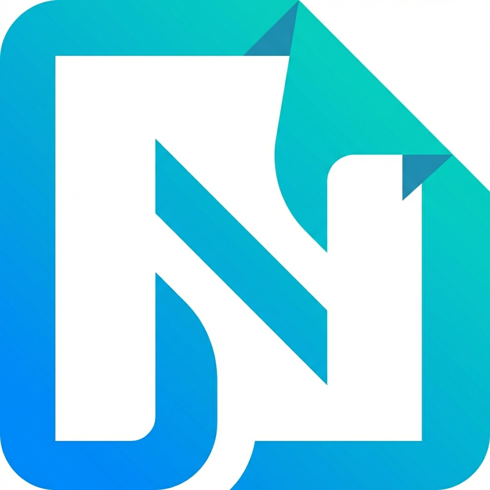

#  Portable Notebook (Browser Extension)

Быстрый и современный блокнот с древовидной структурой, работающий прямо в вашем браузере. Все данные хранятся локально и никогда не покидают ваше устройство.

## Основные возможности
- **Полная приватность**: Данные хранятся в `chrome.storage.local`. Никаких серверов и баз данных.
- **Древовидная структура**: Удобная организация заметок с поддержкой вложенности и Drag & Drop.
- **Мощный редактор**:
  - Автосохранение при каждом изменении.
  - Поддержка блоков кода с подсветкой синтаксиса.
  - Вставка изображений (хранятся в формате base64).
  - Автоматическое преобразование URL в ссылки.
- **Мультиязычность**: Полная поддержка русского и английского языков.
- **Стартовая страница (Dashboard)**: Настраиваемая главная страница с быстрыми ссылками (ярлыками) для мгновенного доступа к внешним ресурсам или локальным файлам.
- **Управление ярлыками**: Добавление, редактирование и удаление ссылок с удобным выбором иконок.
- **Импорт/Экспорт настроек**: Возможность сохранять и переносить конфигурацию стартовой страницы отдельно от основного блокнота.
- **Поиск**: Быстрый полнотекстовый поиск по всем документам с подсветкой совпадений.

## Установка расширения

Поскольку это расширение для разработчиков, его нужно установить вручную:

1.  **Скачайте или клонируйте репозиторий**.
2.  Откройте браузер Chrome (или любой другой на базе Chromium, например Edge или Brave).
3.  Перейдите по адресу `chrome://extensions/`.
4.  Включите **"Режим разработчика"** (Developer mode) в правом верхнем углу.
5.  Нажмите кнопку **"Загрузить распакованное расширение"** (Load unpacked).
6.  Выберите папку проекта (ту, где находится файл `manifest.json`).

Теперь приложение доступно в списке ваших расширений. При клике на иконку оно откроется в новой вкладке.

## Миграция из старой версии (SQLite)

Если у вас остался файл `notebook.db` от предыдущей версии приложения:
1. Запустите скрипт миграции: `python migrate_to_extension.py`.
2. В расширении нажмите кнопку **"Import DB"** и выберите созданный файл `migration_backup.json`.

---

## Технологии
- **Frontend**: Vanilla HTML, CSS, JavaScript.
- **Storage**: Chrome Storage API.
- **Libraries**:
  - `marked.js` — рендеринг Markdown.
  - `turndown.js` — конвертация HTML в Markdown.
  - `highlight.js` — подсветка синтаксиса.
  - `Google Fonts` (Inter, Outfit).

---
Разработано с акцентом на скорость, эстетику и безопасность данных.